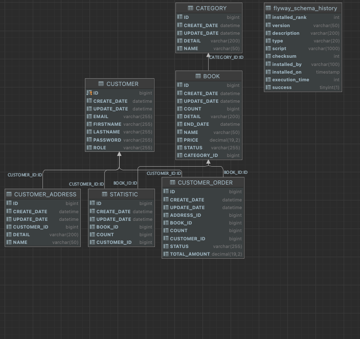

## Reading Is good project

Project written with java 18 + Spring Boot 2.6.6
Tech:
<b>
- Mysql
- Kafka (logging mechanism)
- Redis
- CircuitBreaker
- Spring Security
- Flyway
- Docker (with Volumes)
- Testcontainers
- Swagger
</b>

This service have a 11 endpoint;

1. **POST /v1/authentication/register** for register new Customer

2. **POST /v1/authentication/authenticate** for authenticate Customer

3. **POST /v1/books** for create new books

4. **GET /v1/books/{id}** for get saved book

5. **POST /v1/categories** for create new categories

6. **GET /v1/categories/{id}** for get saved category

7. **POST /v1/customer-addresses** for create new customer addresses

8. **POST /v1/customer-addresses/{id}** for get saved customer address

9. **POST /v1/orders** for create new orders

10. **POST /v1/orders/{id}** for get saved order

11. **GET /v1/statistics** for get monthly statistics

Project have Swagger-ui you can test it in our browser by visiting http://localhost:8080/swagger-ui.html

**BOOK,CATEGORY,CUSTOMER,CUSTOMER_ADDRESS,CUSTOMER_ORDER and STATISTIC** stored in mysql database (dockerized + volume )

**bearer token and categories** stored in redis (dockerized + volume )

For run project ;
1. With Docker :
    - Compile project with Java 17
    - Run with Docker comments , go to project folder and run this commands:

    ```
    $ docker build -t reading-is-good . 
    $ docker-compose -f docker-compose.yaml up -d
    ```
2. With IDE  :
    - Firstly you must be run mysql,kafka,zookeper and redis in docker
    - add your host file
      - 0.0.0.0 reading-is-good
      - 0.0.0.0 zookeeper
      - 0.0.0.0 getir-mysql
      - 0.0.0.0 getir-net
      - 0.0.0.0 getir-kafka
      - 0.0.0.0 getir-redis
    - Run mysql in docker-compose.yaml file and run java project


Project have %79 method coverage with integration test;


-Curl Command
- You can see curl command in http://localhost:8080/swagger-ui.html

-Database Schema MySQL

